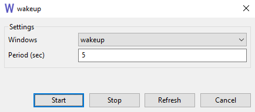

# wakeup

wakeup periodically sends a `WM_ACTIVATE(WA_ACTIVE)` message to choosen window.

You can download the latest build as a zip archive here: [wakeup.zip](https://raw.githubusercontent.com/wiki/nukoseer/wakeup/wakeup.zip)

# Media

